<style>
section::after {
  content: attr(data-marpit-pagination) '/' attr(data-marpit-pagination-total);
}
img[alt~="center"] {
  display: block;
  margin: 0 auto;
}
</style>


# xeus kernels in the browser

## JupyterCon 2023

---

# About

<div class="grid grid-cols-2 gap-4">
<div>

## Johan Mabille

- Technical Director at QuantStack
- Jupyter Distinguished Contributor
- Co-authored the xeus stack, the debugger in Jupyter
- Leads the development of mamba

</div>
<div>

## Thorsten Beier

- Scientific Software Developer at QuantStack
- Co-authored the emscripten-forge stack
- Contributor to many open-source projects 

</div>
</div>

---

# Jupyter architecture


- A well-specified protocol built upon web standards
- Implemented for more than 40 languages

---

# The Jupyter kernel protocol

Clients and kernels communicate (over the network) through 5 channels:
- Shell: code execution, code completion
- Control: stop and restart, kernel info, debugging
- stdin: input request
- IOPub: broadcast channel to publish results and kernel state
- Heartbeat: to check the kernel is still alive

ZeroMQ provides the low-level transport layer over which the messages are sent.


---

# Writing kernels for Jupyter

- Write from scratch in your favorite language
- Adopt the kernel wrapper approach, based on ipykernel
- Build upon xeus, a native implementation of the protocol

---

# Xeus

- xeus is a C++ library which simplifies the implementation of kernels for Jupyter
- developers can focus on implementing the interpreter part of the kernel
- Tutorial for creating a kernel based on xeus: https://xeus.readthedocs.io/en/latest/kernel_implementation.html
- xeus is architected in components that can be replaced with ad-hoc implementations

--- 

# The Xeus Universe


<div class="grid grid-cols-3 gap-4">

  <div>

   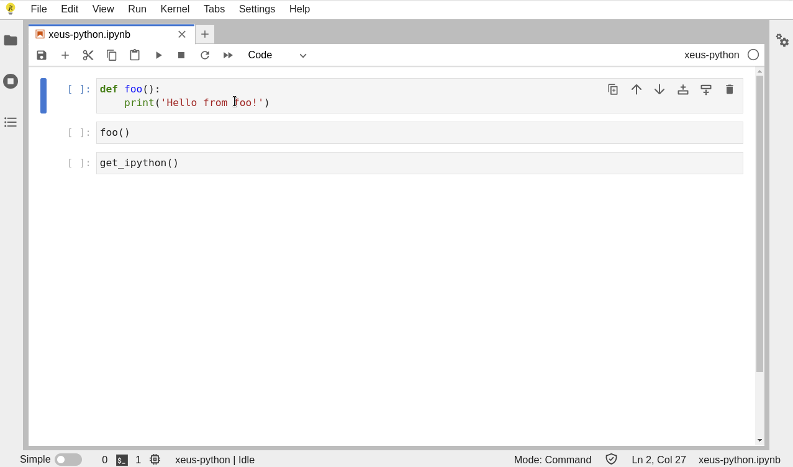
   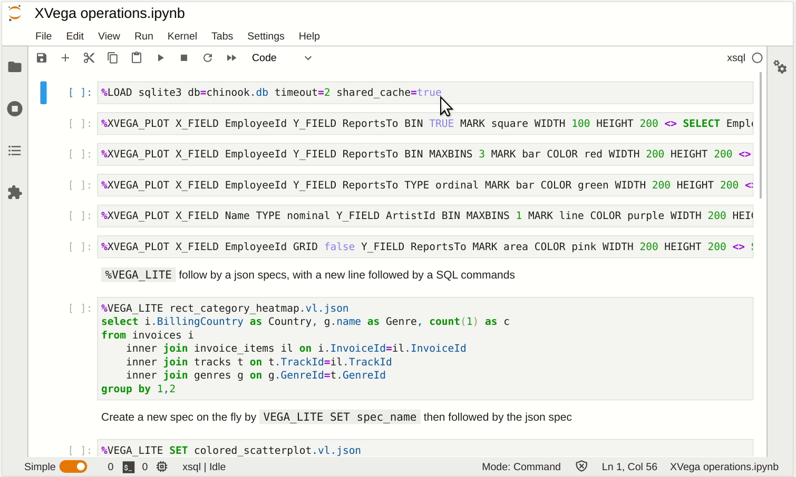
  </div>
  <div>

   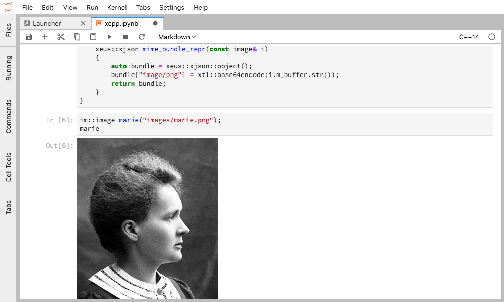
   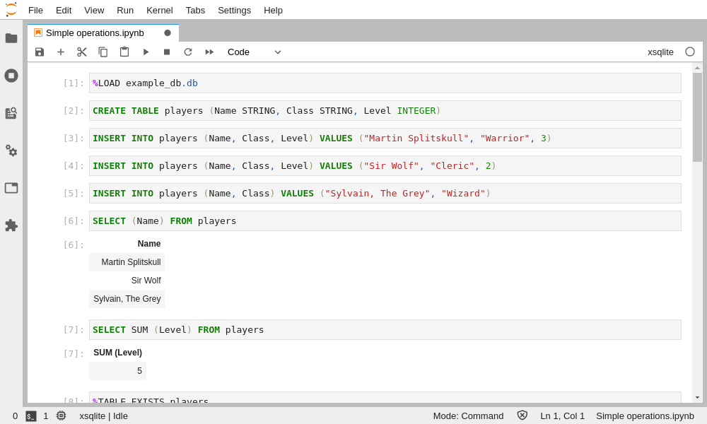


  </div>
  <div>

    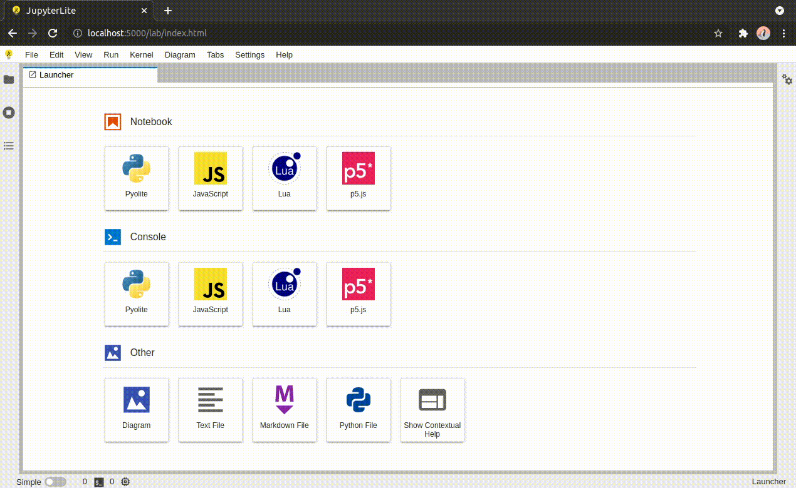
   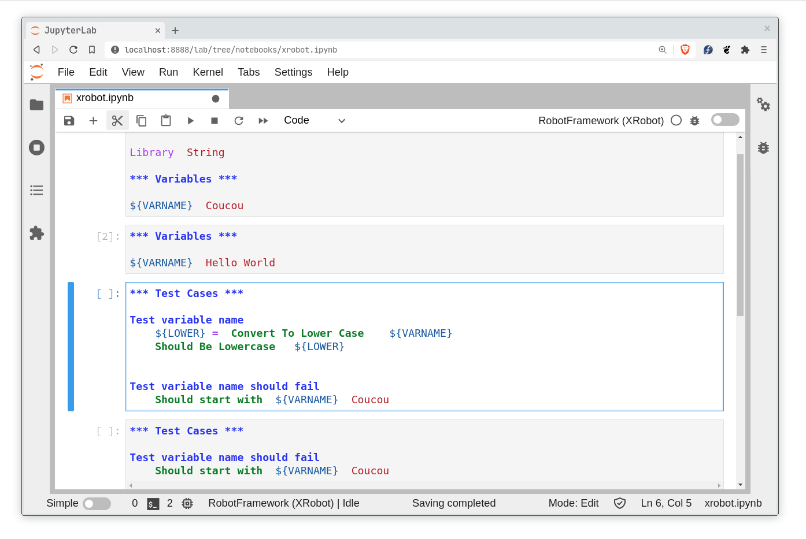
  
  </div>

</div>

---

# The Xeus Universe


<div class="grid grid-cols-3 gap-4">

  <div>

   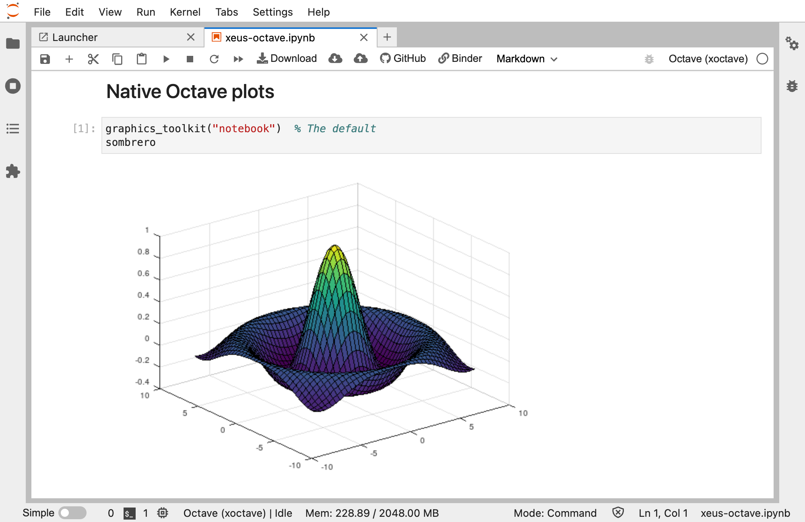
   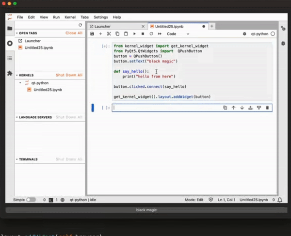

  </div>
  <div>

   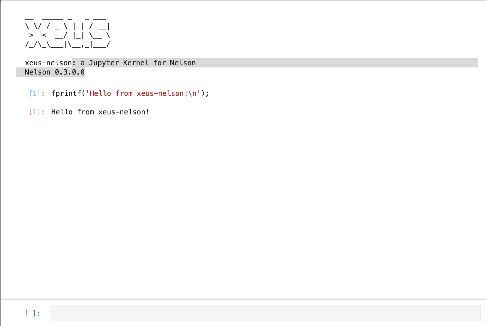
  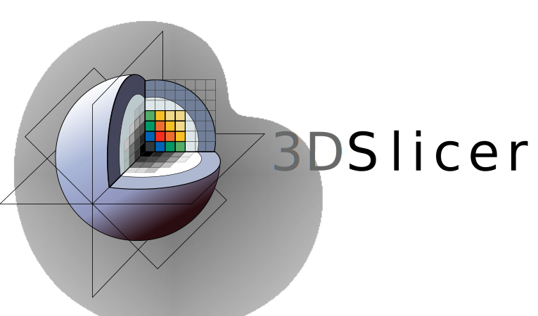 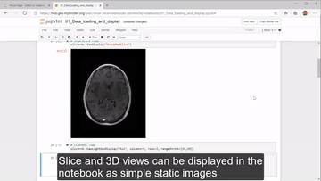
   
  </div>
  <div>

   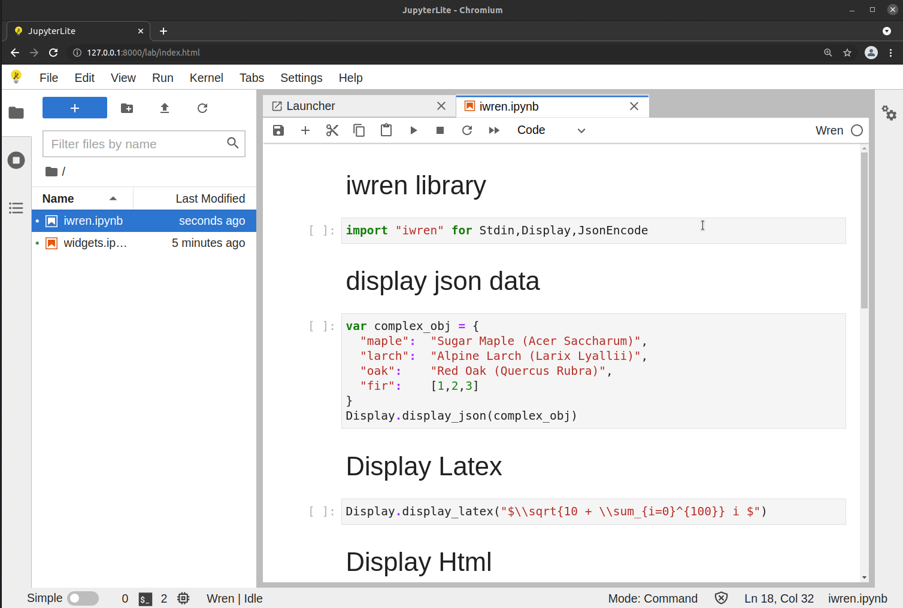
   <br> 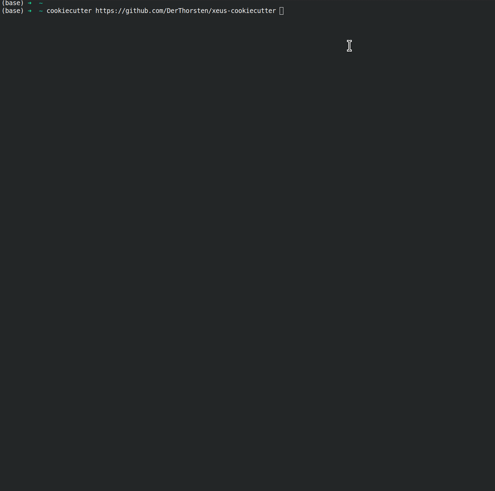

  
  </div>

</div>


<!-- 
---


# The xeus galaxy


- xeus: a native implementation of the Jupyter Kernel Protocol
- xeus + interpreter + glue code = Jupyter kernel
- xeus-cling (C++), xeus-python, xeus-sql, xeus-lua, etc...
- xwidgets: a native backend for the Jupyter interactive widgets -->

---

# Implementing a kernel

<style scoped>
{
   font-size: 1.5rem;
}
</style>

* Start from a cookiecutter template:


```
cookiecutter https://github.com/jupyter-xeus/xeus-cookiecutter
```


* Implement a handfull of methods:
  * execute request
  * complete request
  * inspect request
  * ...


---

# Traditional usage of Jupyter Kernels

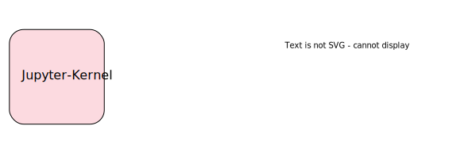


---

# Traditional usage of Jupyter Kernels

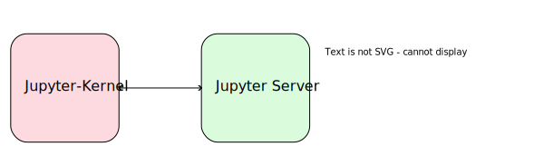


---

# Traditional usage of Jupyter Kernels


--- 

# Traditional usage of Jupyter Kernels


---

# Traditional usage of Jupyter Kernels

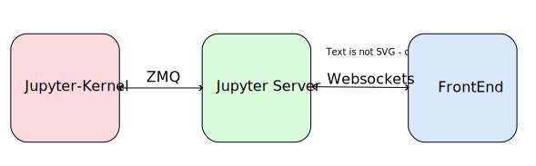


---

# Traditional usage of Jupyter Kernels

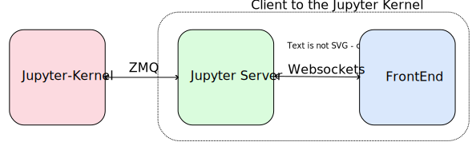


---


* Wasm is a binary instruction format for a stack-based virtual machine
* Portable compilation target for programming languages
* Enabling deployment on the web

---
# Emscripten


### Emscripten is a complete compiler toolchain to WebAssembly, using LLVM, with a special focus on speed, size, and the Web platform.

---


# WebAssembly allows to run native code in the browser.

<style scoped>
{
   font-size: 1.4rem;
}
</style>

<!-- <div class="grid grid-cols-2 gap-4"> -->

<!-- A 2X2 GRID -->
<div class="grid grid-cols-2 grid-auto-rows gap-4">

<div>

  Doom:
   [github.com/cloudflare/doom-wasm](https://github.com/cloudflare/doom-wasm)
  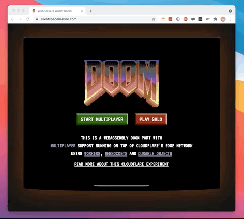

</div>

<div>

  x86 emulator:  
   [https://github.com/copy/v86](https://https://github.com/copy/v86)
  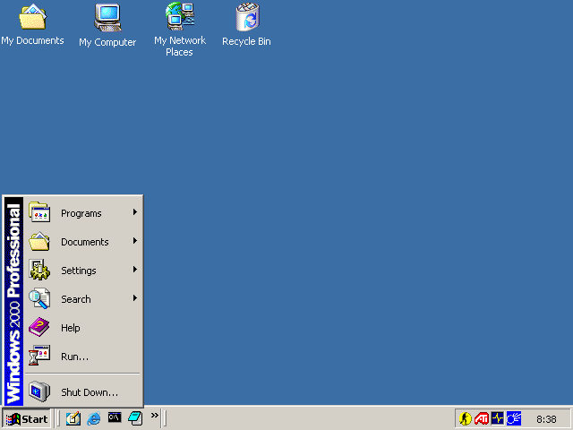

</div>
<div>

  Python:
   [github.com/pyodide/pyodide](https://github.com/pyodide/pyodide)

  * python distribution compiled to WebAssembly
  * runs in the browser
  * includes numpy, pandas, matplotlib, etc...
  *  **write wasm kernels**

</div>
<div>

R-Lang:
[github.com/r-wasm/webr](https://github.com/r-wasm/webr):
 * R interpreter compiled to WebAssembly
 * runs in the browser
 * includes packages compiled to WebAssembly
*  **write wasm kernels**

</div>


</div>

---
<style>section { justify-content: start; }</style>


---


  *  [github.com/jupyterlite/jupyterlite](https://github.com/jupyterlite/jupyterlite)
  * JupyterLab distribution that runs entirely in the browser 
  * Wasm powered kernels running in the browser

  * **JupyterCon**: Creating interactive Jupyter websites with JupyterLite: 
    https://github.com/jtpio/jupytercon-2023-jupyterlite


---

<iframe
src="https://jupyterlite.github.io/demo/lab/index.html"
width="100%"
height="500px"
>
</iframe>


--- 

<style>section { justify-content: start; }</style>

# XeusLite: Xeus kernels for JupyterLite


---

# Architecture of xeus

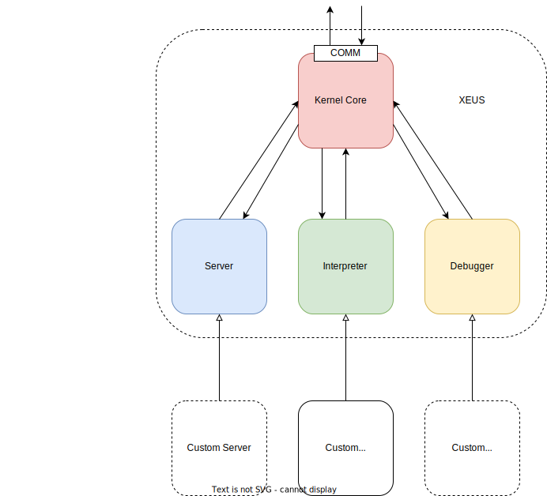

*  [github.com/jupyter-xeus/xeus](https://github.com/jupyter-xeus/xeus)
* Customizable via
    
    * Custom Interpreter
    * Custom Debugger
    * Custom Server
  
* Hard coded to use ZeroMQ
  
    * ZeroMQ is not availalbe when compiling for Wasm


---

# Architecture of xeus (now)


<style scoped>
li {
   font-size: 0.89rem;
}
</style>


* Make xeus agnostic to the communication layer
* Extract `zmq` based server in dedicated package:
   [github.com/jupyter-xeus/xeus-zmq](https://github.com/jupyter-xeus/xeus-zmq)

* Implement Server with `wasm` compatible communication layer:
   [github.com/jupyter-xeus/xeus-lite](github.com/jupyter-xeus/xeus-lite)

---

# Usage of Xeus Kernels with JupyterLite

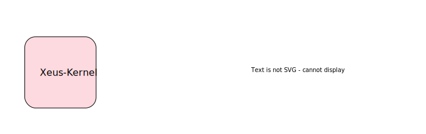

---

# Usage of Xeus Kernels with JupyterLite


---

# Usage of Xeus Kernels with JupyterLite


---

# Usage of Xeus Kernels with JupyterLite

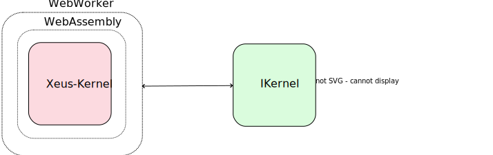

---

# Usage of Xeus Kernels with JupyterLite


---

# Usage of Xeus Kernels with JupyterLite

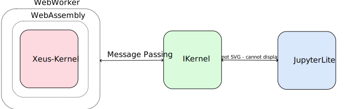

---

# Usage of Xeus Kernels with JupyterLite


---

# Usage of Xeus Kernels with JupyterLite


--- 
# Examples of Xeus-Lite Kernels


<div class="grid grid-cols-2 grid-rows-auto gap-4">

<div>

 

</div>
<div>

  

</div>


<div>

 

</div>

<div>

 

</div>
<div>


</div>

</div>

----

# Applications

## Embed REPL
```html
<iframe
  src="https://jupyterlite.github.io/demo/repl/index.html?kernel=Lua&toolbar=1"
  width="100%"
  height="500px"
>
</iframe>
```

----
## Embed REPL

<iframe
  src="https://jupyterlite.github.io/demo/repl/index.html?kernel=Lua&toolbar=1"
  width="100%"
  height="500px"
>
</iframe>

----

## Embed JupyterLite

```html
<iframe
src="https://jupyterlite.github.io/demo/lab/index.html"
width="100%"
height="500px"
>
</iframe>
```
---
## Embed JupyterLite 

<iframe
src="https://jupyterlite.github.io/demo/lab/index.html"
width="100%"
height="500px"
>
</iframe>

---

# Deploying Xeus Python
-  https://github.com/jupyterlite/xeus-python-demo

  

----

# Outlook
  * improve xeus-lite kernels:
      * dynamic loading of conda packages with mamba
      * dynamic loading of pip packages with pip
  * implement more xeus-lite kernels:
      * xeus-cpp
      * xeus-r 
  * improve testing for xeus-lite kernels
  * ability to generate lite kernels repos from regular kernel repos
  
----

Resources

- Jupyter documentation: https://docs.jupyter.org
- xeus documentation: https://xeus.readthedocs.io
- This presentation: https://derthorsten.github.io/xeus-kernels-browser

----


